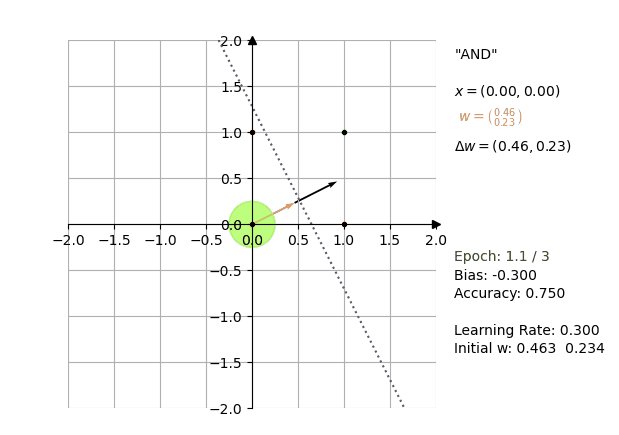

# pylabs
AI implementations with Python

## `Perceptron.py`

Implementation of a **[Rosenblatt-Perceptron](https://en.wikipedia.org/wiki/perceptron)**. 



### Usage

Create input data and the associated output values. As an example, the following represents the logical **AND**-function:

```python
import numpy as np
from Perceptron import Perceptron

# input
X = np.array([
    [0, 0], [0, 1], [1, 0], [1, 1]
])

# output
y = np.array([0, 0, 0, 1])
```

In the next step, the `Perceptron` is created. 

```python 
p = Perceptron(50, 0.3)
```

Once a `Perceptron`-instance is available, you can pass the input- and output-values to `learn()`:

```python 
p.learn(X, y)
```

and test data with

```python 
result = p.test([0, 0])
```

`result` holds the computed weight vector if the training data could be separated within the `epochs`. If that failed,
`None` is returned. 

Note: The `bias` is available with `p.bias`

A log is available for all steps processed by `learn()`:

```python
for step in p.log:
    print(step)
```

You can pass the log to the `PerceptronPlotter` which will recreate the computation visually.

#### API
A `Perceptron`'s constructor takes the following arguments:

#### `n_epochs=10`
 - Type: `int`   
The number of iterations used to calculate the separator for the hyperplane. If a linear separator was found before the epoch-limit is reached, the algorithm stops

#### `learning_rate=1`
 - Type: `float`
The learning rate for the algorithm. The smaller this value, the more steps are required to find the linear separator for the data, so
`epochs` should be adjusted accordingly

#### `w=None`
 - Type: `tupel`
The initial weight vector that should be used. If none provided, a random weight vector will be created.

For more information, consult the source code, which should be pretty self explanatory.

## `PerceptronPlotter.py`

Allows for creating individual images or a complete animation based on the data from a `Perceptron`'s log.

Once you have created a `Perceptron` and fed it with input- and putput-data, `learn()` will determine the linear
separability of the input-data and create a weight-vector, whereas each step of the algorithm is kept in the 
`Perceptron`'s log. To use it with the `PerceptronPlotter`, create an instance and pass the log along with
input- and output-data used by the Perceptron:

```python
from PerceptronPlotter import PerceptronPlotter

plotter = PerceptronPlotter(p.log, X, y, "New Plot")
```

Once the plotter-instance was created, you can either create snapshots of each process or animate the complete process:

```python
# Visualize computational step 5 from the log
plotter.frame(5);
```

```python
# Animate with a frame interval of 500ms
plotter.animate(500);
```

### Examples
Further examples can be found in `plot_perceptron.py`
